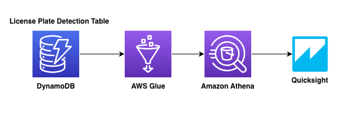

# KVS License Detection Reporting Workflow

This CloudFormation template sets up a comprehensive reporting infrastructure for the KVS License Plate Detection system. It enables data analysis and visualization of license plate detections stored in DynamoDB.

## Overview

The `reporting-workflow.yaml` template creates AWS resources that allow you to:

1. Crawl and catalog license plate detection data from DynamoDB
2. Query the data using Amazon Athena
3. Visualize insights using Amazon QuickSight

## Architecture


The solution creates the following components:
- AWS Glue Database and Crawler to catalog DynamoDB data
- Amazon Athena workgroup and configuration for querying
- Amazon S3 buckets for query results and spill location
- IAM roles and policies for secure access between services

## Prerequisites

- An existing DynamoDB table with license plate detection data (created by the main KVS License Detection stack)
- AWS account with permissions to create the resources in this template
- Amazon QuickSight subscription (for visualization)

## Deployment Instructions

### 1. Deploy the CloudFormation Stack

```bash
aws cloudformation create-stack \
  --stack-name kvs-license-reporting \
  --template-body file://reporting-workflow.yaml \
  --parameters ParameterKey=DynamoDBTableName,ParameterValue=LicensePlateDetections \
  --capabilities CAPABILITY_IAM
```

### 2. Configure the Athena DynamoDB Connector

After stack creation completes:

1. Navigate to the Athena console
2. Choose Data sources and catalogs in the navigation pane
3. Click "Create data source"
4. Search for and select "Amazon DynamoDB"
5. Click "Next"
6. Enter "KVSWorkshop" as the Data source name
7. Use the Browse button to select the spill bucket created by this stack, something similar to "_kvs-reporting-workflow-spillbucket-xxxxxx_"
8. Select the acknowledgement check box and click "Create data source"

### 3. Test the connector with the Athena SQL editor

1. Open the Athena query editor.
2. If this is your first time visiting the Athena console in your current AWS Region, complete the following steps. This is a prerequisite before you can run Athena queries. See Getting Started for more details.
  - a. Choose Query editor in the navigation pane to open the editor.
  - b. Navigate to Settings and choose Manage to set up a query result location in Amazon S3 to be the _kvs-reporting-workflow-athenaquerybucket-xxxx_
3. Under Data, select the data source as Athena-XXXXXXX and database as Default. (you may need to choose the refresh icon for them to sync up with Athena)
4.	Tables belonging to the selected database appear under Tables. You can choose a table name for Athena to show the table column list and data types.
5.	Test the connector by pulling data from your table via a SELECT statement. When you run Athena queries, you can reference Athena data sources, databases, and tables as _<datasource_name>.<database>.<table_name>_. Retrieved records are shown under Results.

### Basic Query for License Plate Detections

```sql
SELECT * FROM "default"."licenseplatedetections" limit 10;
```

### 4. Configure QuickSight Permissions

Add required permissions to the QuickSight service role:

1. Open the IAM console
2. Navigate to Roles and search for "aws-quicksight-service-role-v0"
3. Click "Add permissions" and select "Create inline policy"
4. Select the JSON tab
5. Paste the following Lambda policy:
```json
      {
          "Version": "2012-10-17",
          "Statement": [
              {
                  "Effect": "Allow",
                  "Action": "lambda:InvokeFunction",
                  "Resource": "*"
              }
          ]
      }
```
6. Click "Review policy"
7.  Name the policy "QuickSightLambdaAccess"
8.  Click "Create policy"
9.  Click "Add permissions" again and select "Create inline policy"
10.  Select the JSON tab
11. Paste the following S3 policy:

```json
   {
          "Version": "2012-10-17",
          "Statement": [
              {
                  "Effect": "Allow",
                  "Action": [
                      "s3:GetBucketLocation",
                      "s3:GetObject",
                      "s3:ListBucket",
                      "s3:ListBucketMultipartUploads",
                      "s3:ListMultipartUploadParts",
                      "s3:AbortMultipartUpload",
                      "s3:PutObject"
                  ],
                  "Resource": [
                      "arn:aws:s3:::*"
                  ]
              }
          ]
      }
```
12. Click "Review policy"
13. Name the policy "QuickSightS3Access"
14. Click "Create policy"

### 5. Set Up QuickSight

1. Sign up for QuickSight if you haven't already
2. On the QuickSight console, choose the user profile and switch to the Region you deployed the Athena data source to.
3. Return to the QuickSight home page.
4. In the navigation pane, choose Datasets.
5. Choose New dataset.
6. For Create a Dataset, select Athena.
7. For Data source name, enter a name and choose Validate connection.
8. When the connection shows as Validated, choose Create data source.
9. Under Catalog, Database, and Tables, select the Athena data source,
10. Choose Select.
11. On the Finish dataset creation page, select Import to SPICE for quicker analytics.
12. Choose Visualize.
13. For additional information on QuickSight query modes, see [Importing data into SPICE](https://docs.aws.amazon.com/quicksight/latest/user/spice.html) and [Using SQL to customize data](https://docs.aws.amazon.com/quicksight/latest/user/adding-a-SQL-query.html).
14. For comprehensive information on how to create and share visualizations in QuickSight, refer to {Visualizing data in Amazon QuickSight](https://docs.aws.amazon.com/quicksight/latest/user/working-with-visuals.html) and [Sharing and subscribing to data in Amazon QuickSight](https://docs.aws.amazon.com/quicksight/latest/user/working-with-dashboards.html).


## Resources Created

| Resource Type | Purpose |
|---------------|---------|
| AWS::S3::Bucket (SpillBucket) | Storage for Athena query spill location |
| AWS::S3::Bucket (AthenaQueryBucket) | Storage for Athena query results |
| AWS::Glue::Database | Database to catalog DynamoDB data |
| AWS::Glue::Crawler | Crawler to discover DynamoDB schema |
| AWS::Athena::WorkGroup | Workgroup for Athena queries |
| AWS::IAM::Role (GlueRole) | IAM role for Glue service |
| AWS::IAM::Role (AthenaRole) | IAM role for Athena service |
| AWS::IAM::Role (QuickSightRole) | IAM role for QuickSight service |


## Troubleshooting

1. **Glue Crawler Issues**: Verify that the IAM role has proper permissions to access the DynamoDB table.
2. **Athena Query Failures**: Check that the spill bucket is properly configured and accessible.
3. **QuickSight Connection Problems**: Ensure that the QuickSight service role has the necessary permissions as outlined in the setup instructions.

## Security Considerations

This template implements several security best practices:
- S3 buckets are configured with public access blocks
- IAM roles follow the principle of least privilege
- S3 bucket versioning is enabled for data protection

## Cost Considerations

The following resources in this solution may incur AWS charges:
- AWS Glue Crawler runs (daily by default)
- Amazon Athena queries
- Amazon S3 storage
- Amazon QuickSight subscription

## Cleanup

To delete all resources created by this stack:

```bash
aws cloudformation delete-stack --stack-name kvs-license-reporting
```

## Related Resources

- [Amazon Athena Documentation](https://docs.aws.amazon.com/athena/)
- [AWS Glue Documentation](https://docs.aws.amazon.com/glue/)
- [Amazon QuickSight Documentation](https://docs.aws.amazon.com/quicksight/)
- [Amazon DynamoDB Documentation](https://docs.aws.amazon.com/dynamodb/)
